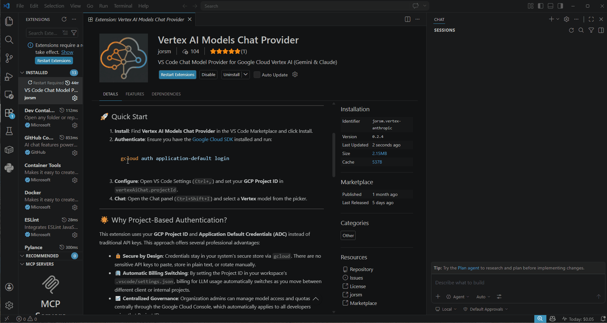

# Google Agent Platform for Copilot Chat - Vertex AI Models Chat Provider

[](https://opensource.org/licenses/MIT)
[](https://code.visualstudio.com/)

## Native Gemini, Claude & open-weight models, powered by **Google Agent Platform** ( *Vertex AI* ) for **Copilot Chat**.

Experience enterprise-grade AI directly within the **standard VS Code Chat panel**.

<p align="center">
  
</p>

This extension registers **Google Gemini**, **Anthropic Claude**, and **MaaS open-weight models** as first-class providers—**no separate UI, no extra windows, no friction.**

- **🔒 Zero API Keys** — Securely uses your native Google Cloud identity or Service Accounts.
- **🏢 Automatic Billing** — Costs follow your project settings as you switch workspaces.
- **⚡ Native Integration** — First-class support for Gemini, Claude, and open-weight models within Copilot Chat.
- **🛡️ Private Auth** — Support for Service Account JSON keys with "Zero-Pollution" local storage.
- **📊 Cost Transparency** — Real-time session tracking, interactive usage dashboard, and opt-in labels for precise Google Cloud Billing attribution.

---

## ☁️ Google Cloud Prerequisites

> ⚠️ **Important:** Before using this extension, ensure your Google Cloud project is properly configured to avoid authentication or permission errors.
>
> 1. **Enable APIs**: Enable the **Agent Platform API** (`aiplatform.googleapis.com`) in the Cloud Console ([Docs](https://docs.cloud.google.com/gemini-enterprise-agent-platform)).
> 2. **IAM Roles**: Your account requires the **Agent Platform User** (`roles/aiplatform.user`) role ([Docs](https://docs.cloud.google.com/iam/docs/roles-permissions/aiplatform#aiplatform.user)).
> 3. **Model Access**: For Anthropic Claude models, find them in the **Google Agent Platform Model Garden** and click **Enable** ([Docs](https://docs.cloud.google.com/gemini-enterprise-agent-platform/models/partner-models/claude)).

## 🚀 Quick Start

1. **Install**: Find **Google Agent Platform for Copilot Chat** in the VS Code Marketplace and click Install.
2. **Authenticate**: Choose one of the following methods:
    - **Option A (Standard)**: Run `gcloud auth application-default login` in your terminal.
    - **Option B (Service Account)**: Run `Google Agent Platform: Paste Service Account JSON Key` or `Google Agent Platform: Import Service Account JSON File`.
3. **Configure**: Open VS Code Settings (`Ctrl+,`) and set your **GCP Project ID** in `vertexAiChat.projectId`.
4. **Chat**: Open the Chat panel (`Ctrl+Shift+I`) and select a **Google Agent Platform** model from the picker.

---

## 📖 Documentation & Wiki

For detailed guides, troubleshooting, and advanced configuration, visit our [Wiki](https://github.com/jorsm/vertex-ai-models-chat-provider/wiki):

- [📖 Quick Start Guide](https://github.com/jorsm/vertex-ai-models-chat-provider/wiki/Quick-Start)
- [🛡️ Service Account Authentication](https://github.com/jorsm/vertex-ai-models-chat-provider/wiki/Service-Account-Authentication)
- [⚙️ Setup & Configuration](https://github.com/jorsm/vertex-ai-models-chat-provider/wiki/Setup-&-Configuration)
- [📊 Usage & Billing Dashboard](https://github.com/jorsm/vertex-ai-models-chat-provider/wiki/Usage-&-Billing)
- [🔍 Diagnostics & Troubleshooting](https://github.com/jorsm/vertex-ai-models-chat-provider/wiki/Diagnostics-&-Troubleshooting)

---

## 🛡️ Enterprise-Grade Authentication

This extension moves away from traditional API keys in favor of **Identity and Project-based authentication**. By using your native Google Cloud credentials or Service Accounts, you gain several professional advantages:

- **🔒 Secure by Design**: Service Account credentials stay in VS Code's encrypted `SecretStorage`; ADC remains under the control of the Google authentication environment. Credentials are never written to workspace settings or the repository.
- **🏢 Automatic Billing Switching**: Simply set a Project ID in your workspace settings. Billing follows your context as you switch between different client or internal projects.
- **📈 Centralized Governance**: Admins can manage model quotas and IAM permissions centrally. Opt-in request labeling provides granular visibility into cost distribution across your organization.
- **⚡ Dedicated Performance**: Leveraging your own GCP project ensures you aren't sharing rate limits with other users on a global API key.

### Supported Methods

Choose the workflow that fits your environment:

- **Standard ADC**: Uses Application Default Credentials available in the extension host, including `gcloud`, attached workload credentials, and other standard ADC sources.
- **Encrypted Secrets**: Paste a Service Account JSON key directly into VS Code. It is stored securely in your OS keychain (via `SecretStorage`) and never touches your repository or `settings.json`.
- **Imported JSON Files**: Select a Service Account JSON file through VS Code. Its contents are imported into `SecretStorage`; the original file is never modified or deleted.
- **Environment Variables**: Automatically respects `GOOGLE_APPLICATION_CREDENTIALS` if set.

### Remote Development

The extension runs in the workspace extension host so its language-model provider is available to Copilot Chat. In Remote SSH, Dev Containers, Codespaces, and similar environments, install the extension in the remote workspace.

Remote authentication is resolved in that workspace environment. Use ADC configured on the remote host, an attached workload identity, `GOOGLE_APPLICATION_CREDENTIALS`, or paste/import a Service Account JSON into the extension. Stored credentials are retrieved into the remote extension process while authenticating, so only use them on remote hosts you trust.

Service Account imports copy a validated snapshot into `SecretStorage`. The extension never modifies or deletes the source file, and removing a stored account affects only this extension—it does not revoke or alter the Google Cloud key.

---

## ✨ Key Features

- **🧠 Advanced Gemini Support**: Full support for **Gemini 3 Flash & Pro**, including "High Thinking" modes with thought block rendering and signature preservation.
- **⚡ Anthropic Performance**: Native support for **Claude Opus, Sonnet, and Haiku**, featuring automated **Prompt Caching (Ephemeral)** and dynamic output limits (up to 128k tokens) to handle large-scale generation.
- **🔑 Smart Auth Recovery**: Detects expired ADC credentials and offers a `gcloud` recovery action. Explicitly selected Service Accounts use **Fail-Closed** logic—if the stored secret is missing or invalid, the extension stops rather than falling back to an ambient system identity.
- **🪄 AI Commit Messages**: Generate professional, conventional commit messages from staged Git changes with one click from the Source Control view.
- **🏷️ Cost Attribution Labels**: Opt-in to propagate user email and workspace names as GCP labels for granular cost tracking in the Google Cloud Console.
- **📊 Local Usage Dashboard and Real Time Costs Estimation**: An interactive, ECharts-powered dashboard to track your individual costs, token consumption, and payload metrics—all stored locally and updated in real time.

- **🔍 Smart Discovery**: Automatically probes regional endpoints (`global`, `us-east5`, `europe-west1`, `asia-southeast1`) to find and register only the models available in your specific GCP project.
- **👁️ Multimodal Vision**: Paste images directly into chat for analysis by vision-capable models like Claude 4.6 and Gemini 3.
- **🛠️ Tool Calling**: Support for streaming parallel tool execution, enabling models to interact with VS Code agents and external tools.

---

## 🤖 Supported Models

| Vendor        | Model Family | Versions Supported                            | Features                      |
| :------------ | :----------- | :-------------------------------------------- | :---------------------------- |
| **Anthropic** | Claude       | Fable 5*, Opus 4.8, Sonnet 4.6, Haiku 4.5     | Vision, Tools, Caching        |
| **Google**    | Gemini       | 3.5 Flash, 3 Flash, 3.1 Pro                   | High Thinking, Parallel Tools |
| **MaaS**      | Open-Weight  | Grok 4.2, DeepSeek V3.2, Qwen3-Coder, Kimi K2 | Thinking, Tools               |

\* Claude Fable 5 may require manual data-sharing opt-in for your GCP project. See [Enabling Claude Fable 5](https://github.com/jorsm/vertex-ai-models-chat-provider/wiki/Enabling-Claude-Fable-5) for details.

> MaaS (Model-as-a-Service) brings open-weight third-party models via an OpenAI-compatible API on Google Agent Platform. See the [MaaS wiki page](https://github.com/jorsm/vertex-ai-models-chat-provider/wiki/Model-as-a-Service-(MaaS)) for details.

---

## ⚙️ Configuration

### Settings (`settings.json`)

| Setting                                | Type      | Default | Description                                                             |
| :------------------------------------- | :-------- | :------ | :---------------------------------------------------------------------- |
| `vertexAiChat.projectId`               | `string`  | `""`    | **Required.** Your GCP Project ID. Overrides ID in JSON keys.           |
| `vertexAiChat.retryMaxDurationMinutes` | `integer` | `30`    | Maximum retry duration for transient failures (429, 503).               |
| `vertexAiChat.hideBillingWarning`      | `boolean` | `false` | Hide the cost warning banner in the dashboard.                          |
| `vertexAiChat.enableUserLabel`         | `boolean` | `false` | **Opt-in.** Include user email as `vscode-vertex-ai-user` label.        |
| `vertexAiChat.enableProjectLabel`      | `boolean` | `false` | **Opt-in.** Include workspace name as `vscode-vertex-ai-project` label. |

### Private Configuration (Command-Managed)

Authentication methods are managed privately per workspace to avoid host-specific path conflicts and Git pollution.

| Action                    | Command                                                        | Description                                                                     |
| :------------------------ | :------------------------------------------------------------- | :------------------------------------------------------------------------------ |
| **Paste JSON Key**        | `Google Agent Platform: Paste Service Account JSON Key`        | Validate, securely store, and activate pasted Service Account JSON.             |
| **Import JSON File**      | `Google Agent Platform: Import Service Account JSON File`      | Import a validated snapshot into `SecretStorage`; the source file is unchanged. |
| **Remove Stored Account** | `Google Agent Platform: Remove Stored Service Account`         | Delete only this extension's copy; Google Cloud resources are unchanged.        |
| **Select Auth Method**    | `Google Agent Platform: Select Authentication Method`          | Switch between stored Service Accounts and default ADC.                         |
| **Clear Auth Method**     | `Google Agent Platform: Clear Authentication Method (Use ADC)` | Reset the workspace to use default ADC.                                         |

---

## Custom Model Catalog

By default, the extension ships with a bundled `models.json` catalog of supported models and the GCP regions to probe. You can override this catalog at two levels so teams can configure their own models per organization policies:

- **Workspace level** — `.vscode/models.json` in the first workspace folder. Commit it to share a model set with your team.
- **User level** — a private `models.json` stored in the extension's global storage, applying across all your workspaces.

**Resolution precedence:** Workspace > User > Bundled. A custom file fully *replaces* the bundled catalog (it is not merged). On first run, each command seeds the file from the bundled catalog so you start from a known-good template.

| Action                         | Command                                             | Description                                                                                               |
| :----------------------------- | :-------------------------------------------------- | :-------------------------------------------------------------------------------------------------------- |
| **Open Workspace models.json** | `Google Agent Platform: Open Workspace models.json` | Create (seeded from bundled) / open `.vscode/models.json` for editing. Requires an open workspace folder. |
| **Open User models.json**      | `Google Agent Platform: Open User models.json`      | Create (seeded from bundled) / open your private user-level `models.json` for editing.                    |

Both files get **JSON schema validation and autocomplete** (model `vendor` enum, required fields, pricing structure) automatically. Saving a custom catalog triggers model re-discovery and refreshes the Copilot Chat model picker within ~300ms.

> **Note:** Multi-root workspaces use the *first* folder for `.vscode/models.json`. If a custom file contains invalid JSON, the extension logs an error, shows a one-shot message, and falls back to the next tier.

---

## �🔍 Diagnostics & Logs

For detailed request/response mapping and troubleshooting:

1. Open the **Output** panel (`Ctrl+Shift+U`).
2. Select **Google Agent Platform for Copilot Chat** from the dropdown.
3. View region probing results, token usage metadata, and raw API transformations.

---

## 🛠️ Installation from Source

If you prefer to build the extension manually:

1. Clone the repository:

    ```bash
    git clone https://github.com/jorsm/vertex-ai-models-chat-provider.git
    ```

2. Install dependencies:

    ```bash
    npm install
    ```

3. Compile and launch:
    - Press `F5` in VS Code to launch the **Extension Development Host**.
    - Or run `npm run compile` to build the TypeScript source.

---

## 📜 License

Distributed under the **MIT License**. See [LICENSE](LICENSE) for more information.
