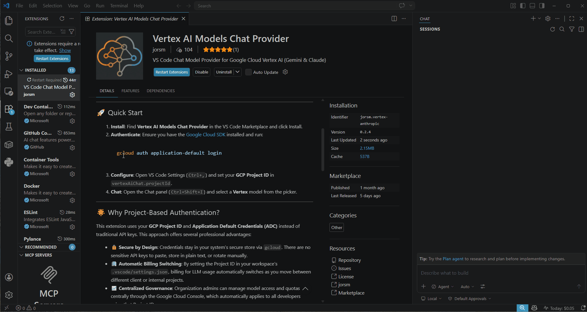

# Google Agent Platform for Copilot Chat

[](LICENSE)
[](https://code.visualstudio.com/)

## Native Gemini, Claude, and Grok models in VS Code Copilot Chat

Use Google Gemini, Anthropic Claude, and xAI Grok directly in the standard VS Code Chat panel. The extension authenticates with Google Cloud, sends requests through Google Agent Platform (Vertex AI), and bills the project you select.

<p align="center">
  
</p>

- **🔒 No API keys** — Authenticate with Google Application Default Credentials or a Service Account stored in VS Code `SecretStorage`.
- **🏢 Project-aware billing** — Use workspace settings to bill the right Google Cloud project as you switch contexts.
- **⚡ Native integration** — Select models and use them alongside other providers in Copilot Chat.
- **📊 Cost visibility** — See local usage estimates and optionally attribute Gemini and Claude PayGo spend with request labels.

## ☁️ Google Cloud prerequisites

Before you start, make sure the target Google Cloud project is ready:

1. **Enable the API:** Enable the Agent Platform API (`aiplatform.googleapis.com`). See the [Google Agent Platform documentation](https://docs.cloud.google.com/gemini-enterprise-agent-platform).
2. **Grant access:** Your identity needs the [Agent Platform User role (`roles/aiplatform.user`)](https://docs.cloud.google.com/iam/docs/roles-permissions/aiplatform#aiplatform.user).
3. **Enable partner models:** Enable any Claude models you plan to use in [Model Garden](https://docs.cloud.google.com/gemini-enterprise-agent-platform/models/partner-models/claude).

## 🚀 Quick start

1. **Install** **Google Agent Platform for Copilot Chat** from the VS Code Marketplace.
2. **Authenticate** in the environment where the extension runs:

   - **Standard ADC:** run `gcloud auth application-default login` in a terminal.
   - **Service Account:** run **Google Agent Platform: Paste Service Account JSON Key** or **Google Agent Platform: Import Service Account JSON File** from the Command Palette.

3. **Set the billing and discovery project** in VS Code Settings (`Ctrl+,`):

   ```json
   {
     "vertexAiChat.projectId": "my-gcp-project-id"
   }
   ```

   Set this in workspace settings when different repositories should use different Google Cloud projects.

4. **Start chatting:** Open VS Code Chat, select a **Google Agent Platform** model, and send a prompt. If the picker is empty, run **Google Agent Platform: Refresh Models**.

For Remote SSH, Dev Containers, and Codespaces, install the extension and configure credentials in the remote workspace environment. See [Setup & Configuration](https://github.com/jorsm/vertex-ai-models-chat-provider/wiki/Setup-&-Configuration).

## ✨ Key features

- **🏷️ Cost attribution labels:** Gemini and Claude PayGo calls can carry user and workspace labels. An enabled label that cannot be resolved produces a clear VS Code and output-channel warning.
- **📈 Usage dashboard and status bar:** Track local daily token usage and estimated cost in real time, then open the dashboard from the status bar for trends and detailed breakdowns.
- **🪄 AI commit messages:** Generate a Conventional Commit-style message from staged Git changes (supports custom prompt for workspace or user).
- **🧠 Gemini thinking and tools:** Supports Gemini thinking modes, thought-signature continuity, vision, and parallel tool calling where available.
- **⚡ Claude thinking and tools:** Supports signed thinking-trace continuity across tool calls, effort aliases, vision, up to 128K output tokens, and ephemeral prompt caching.
- **🔍 Smart discovery:** Probes the available Google Cloud regions and registers only the models that your selected project can access.
- **🛡️ Safe credential handling:** Stored Service Accounts are encrypted in VS Code; an explicitly selected but invalid credential fails closed instead of falling back silently.

## 🤖 Supported models

Models are discovered for your project and region, so only models your project can access appear in the picker.

| Provider  | Current catalog                                                     | Details                                                                                                               |
| :-------- | :------------------------------------------------------------------ | :-------------------------------------------------------------------------------------------------------------------- |
| Google    | Gemini 3 Flash Preview; Gemini 3.7 and 3.8 Flash; Gemini 3.1 Pro    | [Gemini model documentation](https://docs.cloud.google.com/gemini-enterprise-agent-platform/models/gemini)            |
| Anthropic | Claude Fable 5.1 and 5; Opus 5 and 4.8; Sonnet 5 and 4.6; Haiku 4.5 | [Claude on Google Cloud](https://docs.cloud.google.com/gemini-enterprise-agent-platform/models/partner-models/claude) |
| Grok      | Grok 4.6                                                            | [Grok 4.6 documentation](https://docs.cloud.google.com/gemini-enterprise-agent-platform/models/partner-models/grok/grok-4-6) |

Claude Fable 5 and 5.1 require Model Garden access and are subject to Google's [Advanced AI Safety Addendum](https://cloud.google.com/terms/advanced-ai-safety-addendum). Review the [Fable 5.1 documentation](https://docs.cloud.google.com/gemini-enterprise-agent-platform/models/partner-models/claude/fable-5-1) before enabling it.

### Use your own model catalog

Need a different model set or region order? Create a workspace `.vscode/models.json` with **Google Agent Platform: Open Workspace models.json**, or a private user catalog with **Open User Models Catalog File**. Both are seeded from the bundled catalog and receive JSON schema validation. A custom catalog fully replaces the bundled catalog, so include every model you want available. See [Model Discovery & Project Switching](https://github.com/jorsm/vertex-ai-models-chat-provider/wiki/Model-Discovery-&-Project-Switching) for precedence, multi-root behavior, and examples.

For Claude 5 models that support adaptive thinking and the selected [effort](https://platform.claude.com/docs/en/build-with-claude/effort), append `-low`, `-medium`, `-high`, `-xhigh`, or `-max` to both the custom entry's `id` and `version`. The extension removes the suffix before calling Vertex AI, enables adaptive thinking with hidden traces, and sends the selected effort. Unsuffixed generation-5 models use Claude's default high effort.

## 💳 Billing and labels

The local dashboard estimates spend; your Google Cloud Billing account remains the source of truth. Enable `vertexAiChat.enableUserLabel` and `vertexAiChat.enableProjectLabel` when you need cost attribution for Gemini and Claude PayGo requests.

Labels are not forwarded to Billing for Provisioned Throughput. Prefer explicit, stable, non-sensitive `userLabelValue` and `projectLabelValue` values: labels appear in billing exports and overly high-cardinality keys can be dropped. See the [Cost Attribution Labels guide](https://github.com/jorsm/vertex-ai-models-chat-provider/wiki/Cost-Attribution-Labels), Google's [request-label documentation](https://docs.cloud.google.com/gemini-enterprise-agent-platform/models/capabilities/add-labels-to-api-calls), and the [BigQuery billing-export guide](https://docs.cloud.google.com/billing/docs/how-to/export-data-bigquery).

## 📖 Guides and reference

| Topic                                  | Where to go                                                                                                                                                                                                                                 |
| :------------------------------------- | :------------------------------------------------------------------------------------------------------------------------------------------------------------------------------------------------------------------------------------------ |
| Authentication and workspace settings  | [Setup & Configuration](https://github.com/jorsm/vertex-ai-models-chat-provider/wiki/Setup-&-Configuration) · [Service Account Authentication](https://github.com/jorsm/vertex-ai-models-chat-provider/wiki/Service-Account-Authentication) |
| Usage dashboard and BigQuery reporting | [Usage & Billing](https://github.com/jorsm/vertex-ai-models-chat-provider/wiki/Usage-&-Billing) · [Advanced Billing Reports](https://github.com/jorsm/vertex-ai-models-chat-provider/wiki/Advanced-Billing-Reports)                         |
| Custom model catalogs and discovery    | [Model Discovery & Project Switching](https://github.com/jorsm/vertex-ai-models-chat-provider/wiki/Model-Discovery-&-Project-Switching)                                                                                                     |
| AI commit-message generation           | [AI Commit Message Generator](https://github.com/jorsm/vertex-ai-models-chat-provider/wiki/AI-Commit-Message-Generator)                                                                                                                     |
| Diagnostics                            | [Diagnostics & Troubleshooting](https://github.com/jorsm/vertex-ai-models-chat-provider/wiki/Diagnostics-&-Troubleshooting)                                                                                                                 |
| Architecture and provider behavior     | [Architecture](docs/architecture.md) · [Providers](docs/providers.md) · [Usage & Billing internals](docs/usage-and-billing.md)                                                                                                              |
| Current Google Cloud pricing           | [Agent Platform generative AI pricing](https://cloud.google.com/gemini-enterprise-agent-platform/generative-ai/pricing)                                                                                                                     |

## License

[MIT](LICENSE)
