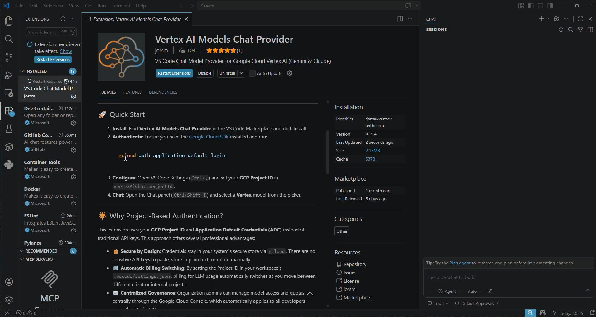

# Google Agent Platform for Copilot Chat

[](LICENSE)
[](https://code.visualstudio.com/)

## Native Gemini, Claude, and Grok models in VS Code Copilot Chat

Use Google Gemini, Anthropic Claude, and xAI Grok directly in the standard VS Code Chat panel. You always choose the Google Cloud project (`vertexAiChat.projectId`) on which the Vertex APIs are invoked and billed. By default the extension calls Vertex directly; organizations can instead route Gemini and Claude through an enterprise proxy to centralize metrics, access policies, and business logic.

<p align="center">
  
</p>

- **🔒 No API keys** — Authenticate with Google Application Default Credentials or a Service Account stored in VS Code `SecretStorage`.
- **🏢 Project-aware billing** — A required `projectId`, settable per workspace, selects the Google Cloud project to invoke and bill as you switch contexts, directly or through a proxy.
- **⚡ Native integration** — Select models and use them alongside other providers in Copilot Chat.
- **📊 Cost visibility** — See local usage estimates and optionally attribute Gemini and Claude PayGo spend with request labels.

## ☁️ Google Cloud prerequisites

Before you start, make sure the target Google Cloud project is ready:

1. **Enable the API:** Enable the Agent Platform API (`aiplatform.googleapis.com`). See the [Google Agent Platform documentation](https://docs.cloud.google.com/gemini-enterprise-agent-platform).
2. **Grant access:** Your identity needs the [Agent Platform User role (`roles/aiplatform.user`)](https://docs.cloud.google.com/iam/docs/roles-permissions/aiplatform#aiplatform.user).
3. **Enable partner models:** Enable any Claude models you plan to use in [Model Garden](https://docs.cloud.google.com/gemini-enterprise-agent-platform/models/partner-models/claude).

> [!TIP]
> **Pro tip:** Set a [monthly Agent Platform spend cap](https://docs.cloud.google.com/billing/docs/how-to/budgets-spend-caps) to receive alerts at 50% and 80% and pause new usage at the limit. Enforcement isn't instant, so some overage is still possible.

## 🚀 Quick start

1. **Install** **Google Agent Platform for Copilot Chat** from the VS Code Marketplace.
2. **Authenticate** in the environment where the extension runs:

   - **Standard ADC:** run `gcloud auth application-default login` in a terminal. This is for direct calls to Vertex; a proxy uses `gcloud auth login` instead (see [Which Google identity makes the call](#which-google-identity-makes-the-call)).
   - **Service Account:** run **Google Agent Platform: Paste Service Account JSON Key** or **Google Agent Platform: Import Service Account JSON File** from the Command Palette.

3. **Set the project** (required) in VS Code Settings (`Ctrl+,`):

   ```json
   {
     "vertexAiChat.projectId": "my-gcp-project-id"
   }
   ```

   `projectId` is mandatory in every mode: it is the project on which the Vertex APIs are invoked and billed. Set it in workspace settings when different repositories should use different Google Cloud projects. Without it, no models are available.

   Optionally, add `vertexAiChat.proxyUrl` to go through an organization proxy (see [Direct or via proxy](#direct-or-via-proxy)). Leave it empty to call Vertex directly.

4. **Start chatting:** Open VS Code Chat, select a **Google Agent Platform** model, and send a prompt. If the picker is empty, run **Google Agent Platform: Refresh Models**.

For Remote SSH, Dev Containers, and Codespaces, install the extension and configure credentials in the remote workspace environment. See [Setup & Configuration](https://github.com/jorsm/vertex-ai-models-chat-provider/wiki/Setup-&-Configuration).

In direct mode, model discovery groups effort variants by their model endpoint and shares each endpoint's result across its catalog entries. It allows up to **45 seconds per endpoint in each region** by default, covering its requests and retry delays after it leaves the queue. If discovery needs more time, change **Model Discovery Timeout Seconds** in VS Code Settings or set a custom value in user or workspace settings:

```json
{
  "vertexAiChat.modelDiscoveryTimeoutSeconds": 90
}
```

Run **Google Agent Platform: Refresh Models** to apply the new timeout. Discovery runs at most **three endpoints concurrently**, spacing initial starts by 500–1,000 ms. Transient failures receive up to **three retries after the first attempt**, with randomized exponential backoff; `Retry-After` is honored within the endpoint's timeout. Endpoints that return 429 remain available with all their catalog effort variants even if retries are exhausted. Endpoints that never respond are skipped. Queue time can make the entire discovery run longer than the per-endpoint timeout.

## Direct or via proxy

`vertexAiChat.projectId` is always required. `vertexAiChat.proxyUrl` is optional and only changes the route:

| `proxyUrl` | Route | Authentication | Project |
| :--- | :--- | :--- | :--- |
| Empty | Extension → Vertex | ADC or Service Account | `projectId` |
| Set | Extension → proxy → Vertex | Personal `gcloud auth login` identity, verified by the proxy | `projectId`, sent to the proxy, which calls Vertex on it |

```json
{
  "vertexAiChat.projectId": "my-gcp-project-id",
  "vertexAiChat.proxyUrl": "https://ai-proxy.example.com"
}
```

### Which Google identity makes the call

Google Cloud keeps two independent credential stores, and the extension uses a different one in each mode:

| | Direct (`proxyUrl` empty) | Via proxy (`proxyUrl` set) |
| :--- | :--- | :--- |
| Credential store | **Application Default Credentials (ADC)** | **Standard `gcloud` accounts** |
| Created with | `gcloud auth application-default login` | `gcloud auth login` |
| Why | The Vertex SDKs (Gemini, Claude, Grok) look up the default credentials themselves | The extension runs `gcloud auth print-identity-token` and sends that token to the proxy |
| Which account | The single ADC identity, or a stored Service Account | The **active** account in `gcloud auth list` |

The two stores do not follow each other. If `gcloud auth list` shows user A as active but `gcloud auth application-default login` was run as user B, direct calls to Vertex are made as **B** and calls through the proxy are authenticated as **A**. Switching `proxyUrl` on or off therefore changes the identity, and so the IAM permissions, quota and audit trail that apply. A Service Account selected in the extension is used only in direct mode and is never accepted by the proxy.

The `vscode-vertex-ai-user` label and the usage dashboard account come from the active `gcloud` account (or the Service Account's email), not from ADC, so in direct mode they can name a different person than the one Vertex bills and authorizes.

To check each identity:

- Standard accounts: `gcloud auth list`; the active account is marked with `*`. Change it with `gcloud config set account <email>`.
- ADC: they are stored in `~/.config/gcloud/application_default_credentials.json` (`%APPDATA%\gcloud\application_default_credentials.json` on Windows) and are not listed by `gcloud auth list`. To change them, run `gcloud auth application-default login` again as the intended user.

When both modes are used, log in to both with the same account, or keep the identities deliberately different and know which one applies. Refresh Models after changing either.

## Enterprise proxy with `proxyUrl`

For organizations that need centralized model access, budgets, telemetry, or conditional access to specific projects, `vertexAiChat.proxyUrl` routes Gemini and Claude calls through your own service. The proxy is where you implement those policies and business logic, such as allowing only cataloged projects and only certain users on each of them. If the proxy cannot call Vertex on your project, the error is shown in VS Code.

`proxyUrl` is a user-level setting; workspace settings cannot change it. To use no proxy for one repository and different proxies for others, create one VS Code profile per route and tie each folder to its profile. `projectId` can still be set per repository in `.vscode/settings.json`. See [using different proxies per workspace](docs/proxy.md#use-no-proxy-proxy-1-or-proxy-2-for-different-workspaces).

See the [enterprise proxy guide](docs/proxy.md) for use cases, configuration, the access model, and the implementation contract.

## ✨ Key features

- **🏷️ Cost attribution labels:** Gemini and Claude PayGo calls can carry user and workspace labels. An enabled label that cannot be resolved produces a clear VS Code and output-channel warning.
- **📈 Usage dashboard and status bar:** Track local daily token usage and estimated cost in real time, then open the dashboard from the status bar for trends and detailed breakdowns.
- **🪄 AI commit messages:** Generate a Conventional Commit-style message from staged Git changes using your own system prompt. Defaults to Gemini 3 Flash (`gemini-3-flash-preview`). Use **Google Agent Platform: Select Commit Message Model** to choose from the current catalog, or edit `vertexAiChat.commitMessageModel` in user, workspace, or folder settings. An empty or unavailable selection shows an error without switching models.
- **🧠 Gemini thinking and tools:** Supports Gemini thinking modes, thought-signature continuity, vision, and parallel tool calling where available.
- **⚡ Claude thinking and tools:** Supports signed thinking-trace continuity across tool calls, effort aliases, vision, up to 128K output tokens, and ephemeral prompt caching.
- **🔍 Smart discovery:** Probes the available Google Cloud regions and registers only the models that your selected project can access.
- **🛡️ Safe credential handling:** Stored Service Accounts are encrypted in VS Code; an explicitly selected but invalid credential fails closed instead of falling back silently.

## 🤖 Supported models

In direct mode, models are discovered for your project and region. In proxy mode, only models in the server's approved catalog appear in the picker.

| Provider  | Current catalog                                                                 | Details                                                                                                                      |
| :-------- | :------------------------------------------------------------------------------ | :--------------------------------------------------------------------------------------------------------------------------- |
| Google    | Gemini 3 Flash Preview; Gemini 3.7 and 3.8 Flash; Gemini 3.1 Pro                | [Gemini model documentation](https://docs.cloud.google.com/gemini-enterprise-agent-platform/models/gemini)                   |
| Anthropic | Claude Fable 5.1 and 5; Opus 5.5, 5, and 4.8; Sonnet 5.5, 5, and 4.6; Haiku 4.5 | [Claude on Google Cloud](https://docs.cloud.google.com/gemini-enterprise-agent-platform/models/partner-models/claude)        |
| Grok      | Grok 4.6                                                                        | [Grok 4.6 documentation](https://docs.cloud.google.com/gemini-enterprise-agent-platform/models/partner-models/grok/grok-4-6) |

Claude Fable 5 and 5.1 require Model Garden access and are subject to Google's [Advanced AI Safety Addendum](https://cloud.google.com/terms/advanced-ai-safety-addendum). Review the [Fable 5.1 documentation](https://docs.cloud.google.com/gemini-enterprise-agent-platform/models/partner-models/claude/fable-5-1) before enabling it.

### Use your own model catalog

In direct mode, need a different model set or region order? Create a workspace `.vscode/models.json` with **Google Agent Platform: Open Workspace models.json**, or a private user catalog with **Open User Models Catalog File**. Both are seeded from the bundled catalog and receive JSON schema validation. A custom catalog fully replaces the bundled catalog, so include every model you want available. In proxy mode, configure the catalog on your server instead; local catalog files are ignored. See [Model Discovery & Project Switching](https://github.com/jorsm/vertex-ai-models-chat-provider/wiki/Model-Discovery-&-Project-Switching) for precedence, multi-root behavior, and examples.

For Claude 5 models that support adaptive thinking and the selected [effort](https://platform.claude.com/docs/en/build-with-claude/effort), append `-low`, `-medium`, `-high`, `-xhigh`, or `-max` to both the custom entry's `id` and `version`. The extension removes the suffix before calling Vertex AI, enables adaptive thinking with hidden traces, and sends the selected effort. Unsuffixed generation-5 models use each model's API default effort. For Claude Sonnet 5.5 that default is `high`; the bundled `Medium` entry follows Anthropic's recommended starting point for well-specified agentic coding and multistep tool use. Move to `high` for harder or longer work, and reserve `xhigh` or `max` for workloads where evaluations show a quality gain.

## 💳 Billing and labels

The local dashboard estimates spend; your Google Cloud Billing account remains the source of truth. Enable `vertexAiChat.enableUserLabel` and `vertexAiChat.enableProjectLabel` when you need cost attribution for Gemini and Claude PayGo requests.

Labels are not forwarded to Billing for Provisioned Throughput. Prefer explicit, stable, non-sensitive `userLabelValue` and `projectLabelValue` values: labels appear in billing exports and overly high-cardinality keys can be dropped. See the [Cost Attribution Labels guide](https://github.com/jorsm/vertex-ai-models-chat-provider/wiki/Cost-Attribution-Labels), Google's [request-label documentation](https://docs.cloud.google.com/gemini-enterprise-agent-platform/models/capabilities/add-labels-to-api-calls), and the [BigQuery billing-export guide](https://docs.cloud.google.com/billing/docs/how-to/export-data-bigquery).

## 📖 Guides and reference

| Topic                                  | Where to go                                                                                                                                                                                                                                 |
| :------------------------------------- | :------------------------------------------------------------------------------------------------------------------------------------------------------------------------------------------------------------------------------------------ |
| Enterprise proxy and centralized controls | [Setup and implementation contract](docs/proxy.md) · [Compatibility verification](docs/proxy-compatibility.md) |
| Authentication and workspace settings  | [Setup & Configuration](https://github.com/jorsm/vertex-ai-models-chat-provider/wiki/Setup-&-Configuration) · [Service Account Authentication](https://github.com/jorsm/vertex-ai-models-chat-provider/wiki/Service-Account-Authentication) |
| Usage dashboard and BigQuery reporting | [Usage & Billing](https://github.com/jorsm/vertex-ai-models-chat-provider/wiki/Usage-&-Billing) · [Advanced Billing Reports](https://github.com/jorsm/vertex-ai-models-chat-provider/wiki/Advanced-Billing-Reports)                         |
| Custom model catalogs and discovery    | [Model Discovery & Project Switching](https://github.com/jorsm/vertex-ai-models-chat-provider/wiki/Model-Discovery-&-Project-Switching)                                                                                                     |
| AI commit-message generation           | [AI Commit Message Generator](https://github.com/jorsm/vertex-ai-models-chat-provider/wiki/AI-Commit-Message-Generator)                                                                                                                     |
| Diagnostics                            | [Diagnostics & Troubleshooting](https://github.com/jorsm/vertex-ai-models-chat-provider/wiki/Diagnostics-&-Troubleshooting)                                                                                                                 |
| Architecture and provider behavior     | [Architecture](docs/architecture.md) · [Providers](docs/providers.md) · [Usage & Billing internals](docs/usage-and-billing.md)                                                                                                              |
| Current Google Cloud pricing           | [Agent Platform generative AI pricing](https://cloud.google.com/gemini-enterprise-agent-platform/generative-ai/pricing)                                                                                                                     |

## License

[MIT](LICENSE)
