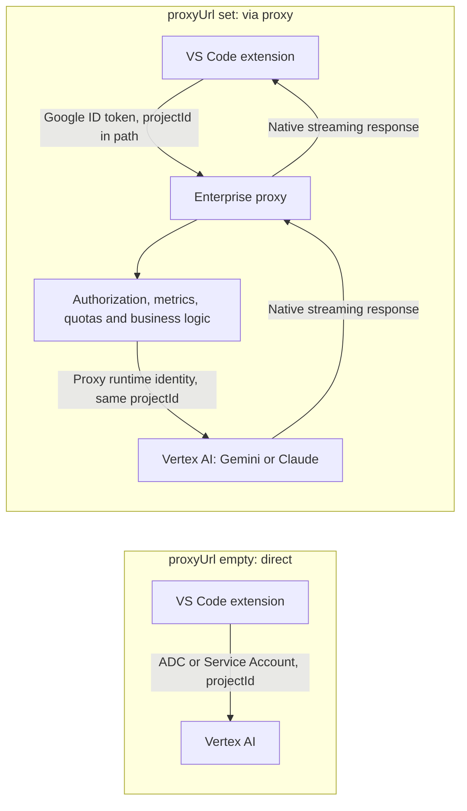

# Enterprise proxy

`vertexAiChat.proxyUrl` routes discovery and inference through an organization-managed HTTP service. Use it when you need centralized metrics, model access rules, quotas, cost allocation, auditing, or other business logic around model calls. Chat, tool continuations, and AI commit-message generation all use this transport. The server controls the advertised catalog; the client does not impose a vendor allowlist. Gemini and Claude currently implement proxy inference. Grok entries are accepted, but the Grok adapter reports that its proxy transport is not supported yet, without acquiring direct credentials or sending a request.

The extension handles the VS Code integration and native model protocols. The `vertexAiChat.projectId` setting is always required: it names the Google Cloud project on which the Vertex APIs are invoked, with or without a proxy. Your proxy authenticates callers, publishes the approved catalog, applies your policies to the requested project, region and model, and forwards responses. You can implement it with Cloud Run, a Cloud Run function, or another HTTP service that meets the authentication and protocol contract below; Python is not a requirement.



In both modes the project, region and model are chosen by the client; the proxy decides whether that selection is permitted. If the proxy's runtime identity cannot call Vertex in the selected project, the upstream error is returned and displayed in VS Code.

## Core access model: users invoke the proxy, the proxy invokes Vertex

The central principle of an enforced enterprise proxy is to separate service invocation from model access. Users receive permission to invoke the proxy service, while the application's Google runtime identity receives permission to call Vertex APIs on their behalf. This applies whether you host the proxy on Cloud Run, Cloud Functions, or another compatible service.

| Principal              | Permissions in this model                                                                                                                                                                                                                           |
| ---------------------- | --------------------------------------------------------------------------------------------------------------------------------------------------------------------------------------------------------------------------------------------------- |
| End user               | Invoke the proxy service and authenticate as themselves. For IAM-protected Cloud Run and Cloud Functions v2, grant an invocation role such as `roles/run.invoker` on the service.                                                                   |
| Proxy runtime identity | Call the approved Vertex APIs in the projects the proxy allows users to select, typically using a dedicated attached Service Account granted Agent Platform User (`roles/aiplatform.user`) or a narrower role covering the required API operations. |

Remove **Agent Platform User (`roles/aiplatform.user`) from end users** on the projects whose access you want to govern through the proxy. They should no longer be able to call Vertex directly using their personal Google credentials. The runtime Service Account performs the upstream call after the proxy authenticates the user and applies its business logic. Vertex authorizes that runtime identity; the proxy records the verified end user for attribution and policy enforcement.

Removing that one role is sufficient only if users have no equivalent access through another grant. Check group membership, inherited folder/organization grants, custom roles, and broader roles such as Editor, Owner, or Agent Platform Administrator. Remove any grants that still permit direct inference, such as `aiplatform.endpoints.predict`, in the governed projects. Do not give end users keys or impersonation permissions for the privileged proxy identity, which would provide another way around the proxy. See [Agent Platform IAM roles and permissions](https://docs.cloud.google.com/iam/docs/roles-permissions/aiplatform) and [function invocation authentication](https://docs.cloud.google.com/functions/docs/securing/authenticating).

Setting `proxyUrl` changes this extension's routing; it does not modify IAM or prevent users from using another client. The organization's effective IAM policy is what makes the proxy the required entry point. The hosting platform's invocation permissions and the runtime identity's Vertex permissions must be configured separately.

## Example use cases

The following are policies you can implement in your proxy. Configuring `proxyUrl` routes requests through your service; it does not enable these controls automatically. Apply inference policies before calling Vertex, and collect usage as the native response streams back.

### Require user or project labels

You need every request attributed to a user, a project, or both. For example, your organization requires `vscode-vertex-ai-project` to contain an approved cost-center identifier before any inference is allowed.

Read Gemini labels from the body and Claude labels from `X-Vertex-AI-Labels`. Reject missing, empty, or invalid required values before forwarding the request, using a `400` error that identifies the missing requirement. You can require an incoming user label or populate it from the authenticated caller before validating the effective labels. Keep discovery accessible without attribution labels: the extension does not send them on `/discovery`.

### Prevent forged user attribution

A caller sets `userLabelValue` to a colleague's name to attribute usage to someone else. Use the email from the verified Google ID token sent with the call as the authoritative caller, rather than trusting `vscode-vertex-ai-user`.

Derive your user attribution from that verified identity, either overwriting the effective user label or storing a separate authenticated-user field. Sanitize the value when forwarding it as a Vertex label. A client label may remain useful as descriptive metadata, but it must not determine whose permissions, quota, or budget apply. Decoding a token without verifying it is insufficient.

### Restrict expensive, old, or deprecated models

You want general users to use approved lower-cost models, reserve more expensive models for selected teams, and retire older versions on a planned date.

Filter `/discovery` for the authenticated caller and enforce the same policy on every inference route. Return `403` for a disallowed model even if the caller crafts a POST request directly. Check the resolved backend model and allowed effort settings explicitly; hiding a picker entry alone does not prevent its use.

### Give users progressive access to models

You want model access to reflect each developer's experience, training, and ability to manage usage costs. For example, a junior developer initially receives only approved, lower-cost models and a small personal budget. Access to higher-cost models such as Fable requires a mentor's approval after the developer demonstrates effective use and cost awareness.

Maintain access profiles on the server, keyed by verified Google identity or trusted organizational group membership. A starter profile can expose only lower-cost models; a trained profile can add selected advanced models with a larger budget; a specialist profile can grant access for specific workloads. Filter `/discovery` for each caller and enforce the same permissions on inference requests. Users cannot promote themselves through client labels or settings.

Define concrete progression criteria, such as completing onboarding, reviewing generated code, solving tasks independently, selecting an appropriate model for the task, and staying within an agreed budget. Use the proxy's usage statistics to support a review with the developer and their mentor, then update the access profile and refresh the model catalog. The aim is to support learning and responsible spending: access to a more capable model alone does not establish either skill or cost discipline.

### Monitor estimated costs in real time

Your operations team wants to see spend as requests complete instead of waiting for billing data to become available. Capture provider-reported input, output, and cache usage from the stream, apply your server-maintained rate card, and publish estimates to a central dashboard or metrics service.

Track in-flight requests separately and update estimates incrementally where the provider supplies usage. Not every stream includes continuous token totals, so final usage may only be available near completion. These are operational estimates: reconcile them with Cloud Billing rather than treating them as final invoice amounts. Record failures and cancellations too, without assuming they consumed no upstream tokens.

### Analyze model and token usage

You want to compare model adoption across teams, identify requests with high token consumption, or measure cache effectiveness and latency.

Aggregate request counts, input/output/cache tokens, duration, errors, and cancellations by model, authenticated user, and authorized project. For example, report weekly model usage by team, cache-hit ratios, or token consumption before and after a model migration. These statistics can be collected from metadata without retaining prompts or responses.

### Bill each client's usage to its own GCP project and billing account

You serve several clients and want each client's Vertex usage charged to its own billing account, while every user keeps the same `proxyUrl` and personal Google login. Each client has a dedicated GCP project, and developers set `vertexAiChat.projectId` in the workspace settings of that client's repository:

| Repository workspace setting `projectId` | Linked Cloud Billing account        |
| ---------------------------------------- | ----------------------------------- |
| `client-a-ai`                            | Client A's billing account          |
| `client-b-ai`                            | Client B's billing account          |
| `company-internal-ai`                    | Your organization's billing account |

Users switch working repositories without changing the endpoint or credentials; the extension sends the workspace's project in every request path. Vertex usage in that project is charged to its linked account, so the project selected by the request determines the billing destination. You do not pass a billing account ID as an inference parameter or change a project's billing association per call. See [Google's project-to-billing-account model](https://docs.cloud.google.com/billing/docs/how-to/view-linked).

The proxy's runtime identity must have the required Vertex permissions in each destination project, or the proxy can select an authorized runtime credential for that destination. End users retain invocation permission on the proxy and no direct Vertex access in those projects. A request for a project where the runtime identity has no access fails upstream and the error is shown in VS Code. Record the requested project in metrics and budget checks, and combine this with the project allowlist below so users cannot charge arbitrary projects.

### Allow only cataloged projects, and only for authorized users

Because `projectId` is chosen by the client, an unrestricted proxy would call Vertex on any project its runtime identity can reach. For advanced governance, keep a server-side registry of the projects the organization has onboarded and map each project to the users or groups allowed to use it:

| Project               | Allowed users or groups                          | Notes                              |
| --------------------- | ------------------------------------------------ | ---------------------------------- |
| `client-a-ai`         | `team-client-a@example.com`                      | Billed to Client A                 |
| `client-b-ai`         | `team-client-b@example.com`, `alice@example.com` | Billed to Client B                 |
| `company-internal-ai` | `all-developers@example.com`                     | Internal experiments, lower budget |

For each inference request, extract the project from `/v1/projects/{projectId}/...` and apply two checks before calling Vertex:

1. The project is in the registry. Reject unknown projects, including projects where the runtime identity happens to have access.
2. The verified caller, from the validated Google ID token, belongs to a user or group allowed for that project. Reject callers who are not allowed, even if they can use the same model on another project.

Return `403` with a clear message for both denials, since neither condition resolves by retrying. The same registry can add finer conditions per project, such as the model subset, approved regions and budgets; for example, `company-internal-ai` can expose only lower-cost models, while client projects expose the contractually approved models. Because discovery has no project in its path, publish the union of models the caller can use on any permitted project, and enforce the project-specific restriction again on inference.

The project in the path is client-controlled input, not proof of entitlement: never derive permissions from it without the authenticated caller. Record the verified caller, requested project, region and decision in metrics, so project access and cost can be audited per user.

### Enforce budgets per user or project

You want a daily estimated-spend limit per authenticated user and a monthly limit per project, with different allowances for different teams.

Maintain shared budget counters on the server and check them before inference. Reserve an estimated allowance atomically for each admitted request, then reconcile it against reported usage; otherwise simultaneous requests can each pass the same budget check and exceed the limit. Bound output tokens where appropriate and define how to account for failures, cancellations, and usage not reported by the provider.

Use the verified caller identity and validate that the caller can charge the selected project; a client-controlled project label alone is not sufficient. Reject exhausted budgets with a permanent policy error such as `403` and a clear message. Reserve `429` for temporary rate limits, since the extension retries it. Budget enforcement based on estimates should include an allowance for in-flight work and later billing adjustments.

## Configure the extension

Sign in with your personal Google account in the environment where the workspace extension host runs:

```sh
gcloud auth login
```

This is the standard `gcloud` login, not `gcloud auth application-default login`. With a proxy the extension runs `gcloud auth print-identity-token` for the **active** account and sends the resulting ID token to the proxy. Direct mode instead uses Application Default Credentials, because the Vertex SDKs look them up themselves. The two stores are independent, so user A can be the active `gcloud` account while user B holds the ADC: proxy calls are then authenticated as A and direct calls are made as B. See [Which Google identity makes the call](../README.md#which-google-identity-makes-the-call) to check and align them.

Set the required `vertexAiChat.projectId` and, in **User Settings**, the optional proxy base URL:

```json
{
    "vertexAiChat.projectId": "my-gcp-project-id",
    "vertexAiChat.proxyUrl": "https://ai-proxy.example.com"
}
```

Run **Google Agent Platform: Refresh Models**. In Remote SSH, Dev Containers, and Codespaces, `gcloud`, the personal login, and access to the proxy must be available in the remote workspace environment.

| Setting or behavior   | Proxy mode                                                                                                                                                                                                                        |
| --------------------- | --------------------------------------------------------------------------------------------------------------------------------------------------------------------------------------------------------------------------------- |
| `proxyUrl`            | Machine-scoped; only the user setting selects the endpoint. Workspace overrides are ignored. To use different proxies (or none) per workspace, use [VS Code profiles](#use-no-proxy-proxy-1-or-proxy-2-for-different-workspaces). |
| URL format            | Absolute HTTPS URL, optionally with a base path. HTTP is accepted only on `localhost`, `127.0.0.1`, or `[::1]`. Credentials, query strings, and fragments are rejected.                                                           |
| `projectId`           | Always required. With a nonempty `proxyUrl`, it is sent to the proxy in the request path (`/v1/projects/{projectId}/...`). An empty value exposes no models.                                                                      |
| Client authentication | The active account of the standard `gcloud auth login`, from which an ID token is obtained for each proxy request. Separate from the ADC and stored Service Accounts used for direct mode, which can belong to a different user.  |
| Model catalog         | Supplied exclusively by the proxy. Bundled, user, and workspace catalogs are ignored.                                                                                                                                             |
| Providers             | Google Gemini and Anthropic Claude. Grok is supported in direct mode only.                                                                                                                                                        |
| Discovery             | One authenticated `GET /discovery`; no inference probes or attribution labels.                                                                                                                                                    |
| Failure               | An empty or failed discovery exposes no models. Requests never fall back to direct Vertex.                                                                                                                                        |

Leave `proxyUrl` empty to use direct mode: the extension calls Vertex itself on `projectId` using ADC or Service Account credentials. Refresh Models after changing the active CLI account or the server catalog. The extension does not install or deploy a proxy for you.

### Use no proxy, proxy 1 or proxy 2 for different workspaces

`projectId` can be set in User, Workspace or Folder settings, so each repository's `.vscode/settings.json` can name its own project. `proxyUrl` cannot: it is machine-scoped and only the user value is read, so a repository cannot redirect your Google ID token to another server. A `proxyUrl` in `.vscode/settings.json` is ignored.

To use a different route per project, give each route its own [VS Code profile](https://code.visualstudio.com/docs/configure/profiles). Each profile has separate user settings, and a folder or workspace can be tied to one profile.

| Profile     | User settings                          | Use for                              |
| ----------- | -------------------------------------- | ------------------------------------ |
| `Personal`  | `vertexAiChat.proxyUrl` empty or unset | Direct to Vertex on your own project |
| `Company A` | `vertexAiChat.proxyUrl` set to proxy 1 | Repositories governed by proxy 1     |
| `Company B` | `vertexAiChat.proxyUrl` set to proxy 2 | Repositories governed by proxy 2     |

1. Create the profiles: **Manage** (gear icon) → **Profiles** → **Create Profile**, one per route.
2. In each profile's **User Settings**, set `vertexAiChat.proxyUrl` as in the table. Leave it out of the `Personal` profile.
3. Set `vertexAiChat.projectId` either in the profile's user settings (one project for everything in that profile) or in each repository's `.vscode/settings.json` (a project per repository). Workspace and folder values override the profile's.
4. Open each repository and run **Profiles: Switch Profile**, or choose **Use this Profile for Current Workspace** in the Profiles editor. VS Code remembers the association and applies the profile whenever that folder or workspace is opened. You can also start it from a terminal with `code --profile "Company A" path/to/repo`.

The association is stored by VS Code in your user data, not in the repository, so it is not shared with teammates. Each teammate creates the same profile names once.

When a profile changes the effective `proxyUrl` or `projectId`, the extension shows a notification and restarts the model refresh. Proxies are never mixed in one window: each window uses the settings of its profile, and requests never fall back to another proxy or to direct Vertex.

The token sent to the proxy comes from the active `gcloud` account (`gcloud auth list`), never from ADC. If each proxy expects a different Google account, make the right account active (`gcloud auth login`, or `gcloud config set account`) before using that profile, then run **Google Agent Platform: Refresh Models**. The active account is global to the machine, so it applies to every open window.

To keep a project in one proxy's registry and another elsewhere, also set each proxy's allowed projects (see [Allow only cataloged projects](#allow-only-cataloged-projects-and-only-for-authorized-users)): a project that is not allowed on that proxy is rejected with `403`.

## Implement a compatible proxy

### Required endpoints

All paths below are appended to `proxyUrl`. If the setting is `https://ai-proxy.example.com/team`, expose `/team/discovery` and `/team/v1/projects/...`. Do not include `/v1` in the configured base URL unless you intentionally want an additional `/v1` segment.

| Method | Path relative to `proxyUrl`                                                                                  | Response                                                           |
| ------ | ------------------------------------------------------------------------------------------------------------ | ------------------------------------------------------------------ |
| `GET`  | `/discovery`                                                                                                 | Complete authorized model catalog as JSON.                         |
| `POST` | `/v1/projects/{projectId}/locations/{region}/publishers/google/models/{model}:streamGenerateContent?alt=sse` | Gemini Vertex JSON request and native Server-Sent Events response. |
| `POST` | `/v1/projects/{projectId}/locations/{region}/publishers/anthropic/models/{model}:streamRawPredict`           | Claude Vertex JSON request and native Server-Sent Events response. |

Implement each inference route for the vendors you advertise. `/health`, `/openapi.json`, and `/v1/models` are optional operational endpoints; the extension does not call them. There is no fallback discovery route and no extension-specific `/predict` endpoint. A standard HTTP forwarding proxy or an OpenAI `/chat/completions` endpoint alone does not implement this contract.

### Authentication and upstream identity

Discovery and inference send:

```http
Authorization: Bearer <personal-google-id-token>
```

The extension obtains this token using `gcloud auth print-identity-token --quiet --verbosity=error`, without `--audiences` or service-account impersonation. It locally checks token shape, verified personal email, and expiry; your server or trusted authentication edge must verify the signature, issuer, token validity, and authorization for the intended service. Local decoding is not server authentication.

The token is cached in memory until one minute before expiry. Concurrent token requests share acquisition, CLI operations are serialized within the authentication manager, and a timed-out token command receives one retry. Each CLI attempt has a 20-second deadline, with Windows process-tree cleanup where a batch launcher is used. Refresh Models clears the token cache.

**Authentication compatibility:** the current client has no configurable target audience, interactive proxy OAuth flow, API-key authentication, or service-account token mode. Google documents generic CLI user ID tokens for development invocation of Cloud Run and Cloud Run functions, rather than production authentication. A proxy that requires an audience-bound token or another login flow needs a corresponding client authentication change; changing `proxyUrl` alone does not provide one. See [Google's ID-token guidance](https://docs.cloud.google.com/docs/authentication/get-id-token#generic) and [Cloud Run developer authentication](https://docs.cloud.google.com/run/docs/authenticating/developers).

Follow the [core access model](#core-access-model-users-invoke-the-proxy-the-proxy-invokes-vertex): the personal token authenticates the caller to the proxy; the application's Google runtime identity authorizes upstream Vertex calls. Authorize the requested project and region, and configure runtime permissions, on the server. Do not forward the incoming caller token to Vertex as its access credential. For an IAM-protected Cloud Run service, grant authorized callers invocation permission as described in the [Cloud Run authentication guide](https://docs.cloud.google.com/run/docs/authenticating/developers).

### Discovery catalog

Return HTTP 200 with `Content-Type: application/json` and this canonical envelope:

```json
{
    "candidateModels": [
        {
            "id": "company-gemini",
            "vendor": "google",
            "version": "gemini-2.5-flash",
            "displayName": "Company Gemini",
            "family": "gemini",
            "maxInputTokens": 1048576,
            "maxOutputTokens": 65536,
            "capabilities": { "imageInput": true, "toolCalling": true },
            "pricing": { "input": 0.3, "output": 2.5, "cache_read": 0.03 }
        },
        {
            "id": "company-claude",
            "vendor": "anthropic",
            "version": "claude-sonnet-5-5",
            "displayName": "Company Claude",
            "family": "claude",
            "maxInputTokens": 1000000,
            "maxOutputTokens": 128000,
            "capabilities": { "imageInput": true, "toolCalling": true },
            "pricing": { "input": 3, "output": 15, "cache_read": 0.3, "cache_create": 3.75 }
        }
    ],
    "regionPriority": ["global"]
}
```

These entries illustrate the schema. Populate versions, limits, capabilities, and prices from your own approved catalog; the example is not a current rate card or an access guarantee.

| Field                               | Contract                                                                                                                                                                                                                                                                                                         |
| ----------------------------------- | ---------------------------------------------------------------------------------------------------------------------------------------------------------------------------------------------------------------------------------------------------------------------------------------------------------------- |
| `id`                                | Unique UI identifier, 1–256 characters matching `[a-zA-Z0-9_.@-]`. It may differ from the backend model.                                                                                                                                                                                                         |
| `vendor`                            | Provider identifier, with the same character constraints as `id`; there is no vendor allowlist. An unregistered adapter produces an inference error rather than invalidating discovery.                                                                                                                          |
| `version`                           | Literal backend model identifier, up to 256 characters. Slash-separated namespaces such as `xai/grok-4.6` are accepted; each segment uses the characters permitted for `id`. Empty segments, `.`/`..` segments, absolute paths, and URLs are invalid.                                                            |
| `displayName`, `family`             | Nonempty text, at most 256 characters. Use the appropriate family, such as `gemini` or `claude`.                                                                                                                                                                                                                 |
| `maxInputTokens`, `maxOutputTokens` | Positive safe integers. The advertised output limit is used in generation requests.                                                                                                                                                                                                                              |
| `capabilities`                      | Required boolean `imageInput` and `toolCalling` fields. Advertise capabilities your proxy preserves.                                                                                                                                                                                                             |
| `pricing`                           | Required finite, non-negative `input` and `output` rates in USD per million tokens. Optional `cache_read` and `cache_create` use the same units.                                                                                                                                                                 |
| `pricing.longContext`               | Optional replacement rate card with a positive integer `inputThresholdTokens`, required `input`/`output`, and optional cache rates. Applies to the whole request when total input, including cached tokens, exceeds the threshold.                                                                               |
| `regionPriority`                    | Required ordered array; each string matches `[a-z][a-z0-9-]*`. The extension initializes adapters with the first advertised region and includes it in inference paths, without client-side region probing. At least one region is required when models are advertised; an empty catalog may have an empty array. |

The legacy `models` field is also accepted instead of `candidateModels` at `/discovery`, with the same model and `regionPriority` validation. A models-only response must add `regionPriority`; the client does not supply a default region. Do not return both `models` and `candidateModels`. Prefer the canonical format for new implementations.

Filter discovery using the authenticated caller's permissions. Return an empty `candidateModels` array when the caller has no available models. Reject unauthorized inference independently of discovery: clients can issue requests outside the picker. Use exact authorization for the literal backend model; broad prefix matching can authorize unintended models.

The extension publishes only the variants explicitly returned. It does not synthesize variants or supplement an empty catalog. Duplicate IDs, malformed vendor identifiers, invalid metadata, malformed JSON, or a response larger than 1 MiB invalidate the whole response. Discovery initializes all registered adapters with the configured gateway; individual adapters report unsupported transports during inference. Discovery uses `vertexAiChat.modelDiscoveryTimeoutSeconds` (45 seconds by default), including token acquisition and response reading. The server's prices drive model information and local usage estimates, with each request retaining its selected rate card.

### Route rewriting and request bodies

The incoming path carries the user's configured `projectId` and the first region from the server's `regionPriority`, which the proxy forwards upstream. Check the location against your approved regions and the model against your allowlist, authorize the caller for the requested project, and never let a client path select an arbitrary hostname or upstream URL. If the proxy's runtime identity cannot call Vertex in that project, the upstream error is returned and shown in VS Code.

The `{model}` path component is the catalog's literal `version`. Effort is an independent JSON request field. Authorize that backend model and the effort choices you enforce. The UI `id` is independent of the upstream route.

Preserve SDK-native requests:

- Gemini sends `contents`, optional `systemInstruction`, `generationConfig`, tools and tool configuration, and root JSON `labels` when enabled. Preserve image data, function calls/responses, and `thoughtSignature` fields through continuations.
- Claude sends its Vertex message payload, including `anthropic_version`, `messages`, `max_tokens`, `stream`, and optional system blocks, tools, thinking/effort configuration, and cache controls. Preserve signed and redacted thinking blocks and tool-result continuations.

Client authentication is independent of these payloads. The client does not send an upstream Service Account key or API key. Its proxy transport removes `x-goog-user-project` and `x-goog-api-key` headers.

### Labels and enterprise policies

Optional inference attribution uses these client label keys:

| Label                      | Resolution                                                                                                                                                              |
| -------------------------- | ----------------------------------------------------------------------------------------------------------------------------------------------------------------------- |
| `vscode-vertex-ai-user`    | Enabled by `enableUserLabel`; explicit `userLabelValue`, otherwise the resolved client identity, using the same authentication identity resolver as direct Vertex mode. |
| `vscode-vertex-ai-project` | Enabled by `enableProjectLabel`; workspace/folder `projectLabelValue`, otherwise the workspace or target repository name.                                               |

Values are sanitized to lowercase letters, digits, underscores, and hyphens, start with a letter, and are truncated to 63 characters. A missing value produces a warning and that label is omitted. Discovery sends neither label. Gemini inference carries labels in the root JSON body; Claude uses `X-Vertex-AI-Labels`, containing base64-encoded UTF-8 JSON. Do not inject root JSON `labels` into Claude requests.

Client labels are attribution hints, not proof of identity or permission. Derive the authenticated caller independently from verified authentication and keep that dimension separate in your metrics. Your business logic can map callers to teams or cost centers, require a project label, overwrite attribution, enforce model/effort access, set per-user limits, or reject requests before upstream inference. These policies belong to your proxy and are not automatically provided by the setting.

Record latency, outcomes, model, authenticated caller, policy decisions, token/cache usage, and cost estimates as needed. Usage can arrive in streaming metadata, so measure it while preserving the native stream. The extension's local dashboard remains a client estimate; centralized metrics and enforcement must be implemented on the server. Decide explicitly what request content, if any, your organization retains, and keep bearer tokens out of logs.

### Streaming responses and cancellation

Return successful inference as HTTP 200 with `Content-Type: text/event-stream`, forwarding events incrementally. Disable response buffering in your handler and any intermediate gateway. Preserve provider usage, finish reasons, tool calls, and signature metadata; replacing the stream with plain text loses extension functionality.

A Gemini event uses native JSON in an SSE `data` field, for example:

```text
data: {"candidates":[{"content":{"role":"model","parts":[{"text":"Hello"}]}}]}

```

Claude uses its native event types (`message_start`, `content_block_start`, `content_block_delta`, `content_block_stop`, `message_delta`, and `message_stop`), for example:

```text
event: content_block_delta
data: {"type":"content_block_delta","index":0,"delta":{"type":"text_delta","text":"Hello"}}

```

These are individual event illustrations, not complete responses. Each SSE frame ends with a blank line. Preserve the full upstream sequence and forward `alt=sse` for Gemini.

VS Code Stop aborts the client transport. Configuration changes also abort the old gateway. On client disconnection, close the upstream stream and release resources. Client cancellation does not itself guarantee immediate cessation of upstream computation or billing. After streaming begins, terminate failures using the native provider protocol or close the stream; do not append an unrelated JSON response or restart generation.

### Errors and retries

Return non-2xx status codes before streaming starts, using the provider-compatible JSON error envelope. For example, a policy denial:

```json
{
    "error": {
        "code": 403,
        "message": "This model is not available for your team.",
        "status": "PERMISSION_DENIED"
    }
}
```

| HTTP status                                                                         | Meaning and extension behavior                                                                                                                                 |
| ----------------------------------------------------------------------------------- | -------------------------------------------------------------------------------------------------------------------------------------------------------------- |
| `400`                                                                               | Invalid input or unmet policy requirement; no inference retry.                                                                                                 |
| `401`                                                                               | Missing or invalid caller authentication; the extension suggests personal CLI reauthentication.                                                                |
| `403`                                                                               | Caller authenticated but request/model denied; no inference retry.                                                                                             |
| `404`                                                                               | Unknown route/model; no alternate endpoint is tried.                                                                                                           |
| `429`, `503`                                                                        | Temporary quota/availability failure; eligible for up to two pre-stream inference retries, with a 60-second retry budget. Preserve `Retry-After` when present. |
| `502` with `error.status` or `error.reason` set to `UPSTREAM_AUTHENTICATION_FAILED` | Proxy's upstream credentials failed; no inference retry and no instruction to replace the caller's login.                                                      |

Other statuses are not automatically retried by the proxy inference policy. Do not describe permanent denials as `429` or `503`. Retry eligibility uses HTTP status and the upstream-authentication marker, not quota-related words in the message. Discovery itself does not use the inference retry loop. Partial streams are never restarted, and both SDKs' additional retry layers are disabled in proxy mode.

## Troubleshooting

| Symptom                                                | Check                                                                                                                                                                                               |
| ------------------------------------------------------ | --------------------------------------------------------------------------------------------------------------------------------------------------------------------------------------------------- |
| Error that `vertexAiChat.projectId` is required        | Set it; it is required with or without `proxyUrl`. Without it the extension stops before requesting a token or contacting the proxy, and the notification offers **Open Settings**.                 |
| Proxy setting in `.vscode/settings.json` has no effect | `proxyUrl` is user-scoped by design. Set it in User Settings, using a [VS Code profile](#use-no-proxy-proxy-1-or-proxy-2-for-different-workspaces) per proxy.                                       |
| Request denied for a project                           | The proxy rejected the `projectId` (not cataloged or not allowed for you), or its runtime identity lacks Vertex access there. Check the `projectId` setting and the proxy's project policy and IAM. |
| Empty picker                                           | Verify authenticated `/discovery`, approved models, metadata validity, and the complete envelope. Local catalogs cannot restore missing server models.                                              |
| Token acquisition failure                              | Check the active personal CLI account and ensure impersonation is unset in the extension-host environment; run `gcloud auth login` when credentials need renewal.                                   |
| CLI timeout                                            | Inspect **Google Agent Platform for Copilot Chat** in Output and network access. A timeout is distinct from expired credentials.                                                                    |
| CLI absent after installation                          | Restart VS Code so its extension host receives the updated PATH.                                                                                                                                    |
| Redirect or route failure                              | Expose endpoints directly under the configured base path. Redirect responses are rejected.                                                                                                          |
| Text arrives only at completion                        | Disable server/gateway buffering and verify native SSE framing.                                                                                                                                     |
| Tools or later turns fail                              | Preserve signatures, native tool payloads, and complete provider event sequences.                                                                                                                   |
| Upstream authentication failure                        | Repair the proxy runtime's credentials and Vertex permissions.                                                                                                                                      |

Use the [compatibility verification guide](proxy-compatibility.md) to validate your implementation. The contract is implemented by [ProxyGateway](../src/ProxyGateway.ts), [AuthManager](../src/AuthManager.ts), [the dispatcher](../src/VertexChatModelDispatcher.ts), and the [Gemini](../src/providers/VertexGoogleProvider.ts) and [Claude](../src/providers/VertexAnthropicProvider.ts) providers.

When an attribution checkbox is enabled, inference resolves its value using the
request's workspace/folder configuration. An absent/empty value or a failed automatic lookup immediately raises a local
configuration error and displays an error notification. Chat and commit-message
actions validate labels before starting discovery or inference in both proxy
and direct Vertex mode: neither backend is contacted when this validation fails. User labels use the same client identity resolver in proxy and direct Vertex
mode; the proxy ID token is used only for authenticating proxy calls.

Permanent proxy HTTP errors (including missing-label `400`) are not retried by
the extension or its SDKs. At the VS Code provider boundary they are exposed as
`LanguageModelError` with the original HTTP status in the message: `Blocked`
for invalid requests, `NoPermissions` for `401`/`403`, and `NotFound` for `404`.
`429` and `503` retain the existing bounded retry behavior. Copilot or another
consumer can implement its own retry policy; some Copilot versions convert all
external-provider errors to a generic failure regardless of the error code.
The extension cannot guarantee that those consumers stop retrying.

## Independent thinking effort (`effort-v1`)

The client sends `X-Vertex-AI-Catalog-Capabilities: effort-v1` on authenticated **GET /discovery only**, with no billing attribution. A server advertising effort metadata acknowledges with top-level `"catalogCapabilities": ["effort-v1"]`. See the [effort fixture](../test/fixtures/effort-proxy-enhanced.json) and [basic fixture](../test/fixtures/effort-proxy-basic.json). This acknowledgement is a wire-envelope field, not a field in local `models.json`. Unknown capabilities, unacknowledged effort metadata, malformed configuration, redirects or duplicate IDs fail the response without local fallback.

Models use literal backend `version` names. Optional `effort` contains named `values` and a `default` from that list. Every request for a model with effort metadata sends its resolved named level, including when no preference is saved. A model without effort metadata sends no override. Saved preferences cannot widen server choices or populate an empty catalog. Grok proxy transport remains unsupported.

The server must enforce backend, project, region and effort on inference; UI validation is not authorization. Preserve native Claude `output_config.effort` and adaptive thinking, Gemini `generationConfig.thinkingConfig.thinkingLevel`, signed history, labels, authentication, SSE and cancellation. Backend APIs validate model support.

Deploying this contract on a production proxy is a separate server action. Client fixtures do not establish server deployment or live authorization; see [verification](thinking-effort-verification.md).
